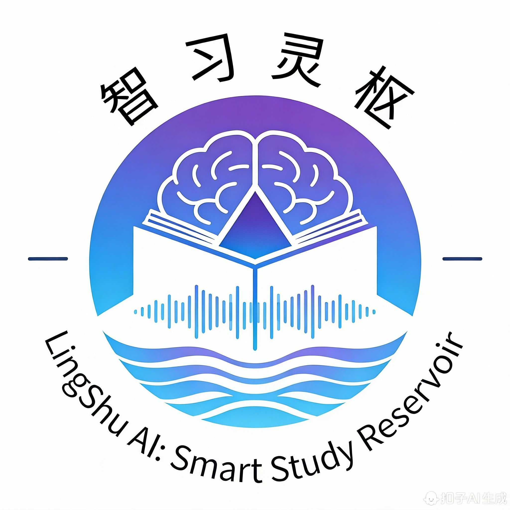

<div align="center">
   
   <h2>智习灵枢：AI Agent自习室预约系统</h2>
   <h3>LingShu AI: Smart Study Reservoir</h3>
   
   
   
   
   <br/>
   
   
</div>


## 📢 项目简介

**智习灵枢**是一款基于 AI Agent 的智能自习室座位预约管理系统，采用前后端分离架构，提供 Web 管理后台和微信小程序双端应用。系统融合了现代化的座位预约、智能推荐、信用管理等功能，致力于为高校和图书馆提供高效、智能的自习室管理解决方案。

ps: 目前正出于初步开发阶段，基础代码完善后会统一采用 MIT 开源协议开源，欢迎大家参与贡献！

### 🎯 核心特色

- **🤖 AI 智能助手**: 基于 RAG 技术的智能对话预约，根据用户历史偏好推荐最佳座位及个性化服务推送
- **🤖 AI Agent**: 基于AI Agent支撑数据安全，防范敏感数据，适配高校场景
- **📱 双端应用**: Web 管理后台 + 微信小程序，满足管理员和用户不同需求
- **🏆 学习成就系统**: 学习时长统计、排行榜、徽章称号，激励用户养成良好学习习惯
- **💳 信用积分体系**: 违约惩罚与信用恢复机制，规范用户预约行为
- **🔄 微服务演进**: 当前正在从单体架构重构为多租户微服务架构，支持更大规模应用

### 🛠️ 技术栈

**后端技术**

https://github.com/SmartLingShu/lingshu-cloud

- 核心框架：Spring Boot 3.5.8、Spring Security 6、JWT
- 数据层：MyBatis-Plus、MySQL 8、Redis8
- 接口文档：Knife4j、Swagger
- 定时任务：XXL-Job
- 消息队列：RabbitMQ / RocketMQ
- 文件存储：MinIO

**前端技术**

https://github.com/SmartLingShu/lingshu-vue3

https://github.com/SmartLingShu/lingshu-mini

- 管理后台：Vue 3、Element-Plus、TypeScript
- 小程序端：UniApp、微信小程序原生组件
- 数据可视化：ECharts

**AI 技术**
- RAG（检索增强生成）
- Prompt Engineering
- 外部大模型 API 对接

## ✨ 功能特性

### 📊 后端管理系统（Vue3 + Spring Boot）

#### 基础设施管理
- **教学楼管理**: 教学楼信息的增删改查
- **楼层管理**: 楼层配置与关联管理
- **教室管理**: 教室信息、容量、开放时间配置
- **座位管理**: 座位配置、座位图标、通用/专属座位设置

#### 预约与记录管理
- **预约记录管理**: 预约记录查询、筛选、导出
- **预约统计分析**: 预约量统计、热门时段分析
- **座位使用率统计**: 座位利用率报表

#### 公告与通知
- **公告管理**: 公告发布、编辑、删除
- **定时发布**: 支持公告定时发布与自动撤回
- **附件管理**: 公告附件上传与管理

#### 用户管理
- **黑名单管理**: 违规用户管理、封禁与解封
- **信用积分管理**: 用户信用分查询与调整（🚀 规划中）
- **用户行为分析**: 用户预约习惯分析（🚀 规划中）

#### 系统管理
- **用户管理**: 管理员用户的增删改查
- **角色管理**: 角色权限配置
- **菜单管理**: 菜单与按钮权限管理
- **部门管理**: 组织架构管理
- **字典管理**: 系统字典配置
- **日志管理**: 操作日志与登录日志

#### 数据统计
- **访问量统计**: 系统访问量实时统计
- **访问趋势分析**: 访问趋势图表展示
- **预约数据分析**: 预约量、取消率等数据分析

#### 文件管理
- **教室图片管理**: 教室环境图片上传与展示
- **公告附件管理**: 公告附件上传与下载

### 📱 小程序端（UniApp）

#### 用户认证
- **微信一键登录**: 微信授权快速登录
- **用户信息管理**: 个人信息编辑与维护

#### 首页功能
- **轮播图展示**: 首页轮播图公告
- **公告列表**: 最新公告查看与详情

#### 自习室浏览
- **教室列表**: 自习室列表展示
- **搜索功能**: 按教学楼、楼层、教室名搜索
- **教室详情**: 教室信息、座位分布、开放时间查看

#### 座位预约
- **座位选择**: 可视化座位图选择座位
- **预约提交**: 选择时间段提交预约
- **预约确认**: 预约成功通知

#### 预约管理
- **预约清单**: 我的预约记录查看
- **预约取消**: 提前取消预约（🚀 规划中：释放座位可获积分奖励）
- **预约续约**: 座位空闲时延长预约时间（🚀 规划中）

#### 扫码功能
- **扫码签到**: 到达座位扫码签到
- **扫码签退**: 离开座位扫码签退

#### 个人中心
- **用户信息**: 个人信息展示与编辑
- **学习统计**: 学习时长、学习报告（🚀 规划中）
- **信用积分**: 信用分查看与明细（🚀 规划中）
- **学习成就**: 徽章、称号、排行榜（🚀 规划中）

## 🚀 未来功能规划

### 1️⃣ 违约惩罚与信用积分系统

**功能描述**
- 用户信用积分体系（初始100分）
- 爽约扣分、按时履约加分
- 信用等级影响预约权限（低信用用户限制预约时长）
- 信用恢复机制（连续履约可恢复）
- 黑名单自动化管理

**技术实现**
- 积分规则引擎设计
- 定时任务检测违约行为
- 预约权限动态控制
- 积分变动记录与查询

### 2️⃣ 座位使用时长统计与学习报告

**功能描述**
- 个人学习时长统计（日/周/月）
- 学习时段分析（最高效时段识别）
- 学习习惯报告（早鸟型/夜猫子型）
- 学习排行榜（周榜/月榜）
- 学习成就系统（徽章、称号）

**技术实现**
- 签到签退数据统计分析
- 数据可视化（ECharts 图表）
- 成就系统设计与实现
- 排行榜实时更新机制

### 3️⃣ 预约时段灵活化与续约功能

**功能描述**
- 支持按小时预约（最小单位30分钟）
- 临时续约功能（座位空闲时可延长）
- 提前释放座位（释放后积分奖励）
- 预约时段模板（如"工作日晚上"）

**技术实现**
- 时间段冲突检测算法
- 座位状态实时更新
- 积分奖励机制
- 预约模板配置

### 4️⃣ 失物招领与留言板

**功能描述**
- 自习室失物招领发布
- 教室留言板（学习资料分享、组队信息）
- 座位便签功能（临时离开留言）
- 敏感词过滤

**技术实现**
- 内容审核机制
- 图片上传与展示
- 消息推送通知
- 敏感词库维护

### 5️⃣ AI 智能助手

**功能描述**
- 基于 RAG 的智能对话预约
- 根据用户历史预约及偏好推荐座位
- 学生反馈智能分析
- 常规咨询自动应答
- 预约配置优化建议

**技术实现**
- 外部大模型 API 对接（如 OpenAI、文心一言、通义千问）
- RAG（检索增强生成）技术
- Prompt Engineering 优化
- Content Engineering 内容工程
- 用户画像构建与偏好分析

### 6️⃣ 学习成就系统

**功能描述**
- 个人学习时长统计（日/周/月）
- 高效时段与学习习惯分析
- 学习排行榜（全校/院系/班级）
- 徽章称号成就系统
- 成就分享功能

**技术实现**
- 多维度数据统计
- 成就解锁规则引擎
- 排行榜缓存优化
- 社交分享接口

### 7️⃣ 组队学习功能

**功能描述**
- 创建学习小组
- 加入学习小组
- 小组聊天功能（类似 QQ 群组）
- 小组预约（组队占座）
- 小组学习统计

**技术实现**
- 群组管理系统
- WebSocket 实时聊天
- 群组预约冲突处理
- 小组数据统计

### 8️⃣ 微服务架构演进

**架构升级**
- 当前：单体架构（Monolithic Architecture）
- 未来：微服务架构（Microservices Architecture）

**拆分规划**
- 用户服务（User Service）
- 预约服务（Reservation Service）
- 座位服务（Seat Service）
- 通知服务（Notification Service）
- AI 服务（AI Service）
- 文件服务（File Service）
- 统计服务（Statistics Service）

**技术选型**
- 服务注册与发现：Nacos
- 服务网关：Spring Cloud Gateway
- 服务调用：OpenFeign
- 服务熔断：Sentinel
- 分布式事务：Seata
- 链路追踪：SkyWalking

## 📁 项目目录

```
lingshu-study-reservoir-java
├── sql                                 # SQL脚本
│   ├── mysql5                          # MySQL5 脚本
│   └── mysql8                          # MySQL8 脚本
├── src                                 # 源码目录
│   ├── main
│   │   ├── java
│   │   │   └── com.youlai.boot
│   │   │       ├── common              # 公共模块
│   │   │       │   ├── base            # 基础类
│   │   │       │   ├── constant        # 常量
│   │   │       │   ├── enums           # 枚举类型
│   │   │       │   ├── exception       # 异常处理
│   │   │       │   ├── model           # 数据模型
│   │   │       │   ├── result          # 结果封装
│   │   │       │   └── util            # 工具类
│   │   │       ├── config              # 配置模块
│   │   │       │   ├── property        # 配置属性
│   │   │       │   ├── CorsConfig      # 跨域配置
│   │   │       │   ├── MybatisConfig   # MyBatis配置
│   │   │       │   ├── RedisConfig     # Redis配置
│   │   │       │   ├── SecurityConfig  # Security配置
│   │   │       │   ├── SwaggerConfig   # 接口文档配置
│   │   │       │   └── XxlJobConfig    # 定时任务配置
│   │   │       ├── core                # 核心功能
│   │   │       │   ├── annotation      # 注解定义
│   │   │       │   ├── aspect          # 切面
│   │   │       │   ├── filter          # 过滤器
│   │   │       │   ├── handler         # 处理器
│   │   │       │   └── security        # Security安全中心
│   │   │       ├── srrs                # 自习室预约模块
│   │   │       │   ├── building        # 教学楼管理
│   │   │       │   ├── floor           # 楼层管理
│   │   │       │   ├── classroom       # 教室管理
│   │   │       │   ├── seat            # 座位管理
│   │   │       │   ├── appointment     # 预约管理
│   │   │       │   ├── announcement    # 公告管理
│   │   │       │   └── blacklist       # 黑名单管理
│   │   │       ├── shared              # 共享模块
│   │   │       │   ├── auth            # 认证模块
│   │   │       │   ├── file            # 文件模块
│   │   │       │   ├── codegen         # 代码生成模块
│   │   │       │   ├── mail            # 邮件模块
│   │   │       │   ├── sms             # 短信模块
│   │   │       │   └── websocket       # WebSocket模块
│   │   │       ├── system              # 系统模块
│   │   │       │   ├── controller      # 控制层
│   │   │       │   ├── service         # 业务逻辑层
│   │   │       │   ├── mapper          # 数据访问层
│   │   │       │   └── model           # 模型层
│   │   │       └── BackEndApplication  # 启动类
│   │   └── resources
│   │       ├── mapper                  # MyBatis XML映射文件
│   │       ├── bootstrap.yml           # 启动配置
│   │       └── logback-spring.xml      # 日志配置
│   └── test                            # 测试目录
├── docker-deploys                      # Docker部署配置
│   ├── compose-dev.yml                 # 开发环境
│   ├── compose-test.yml                # 测试环境
│   ├── compose-prod.yml                # 生产环境
│   └── config                          # 中间件配置
│       ├── mysql
│       ├── redis
│       ├── nacos
│       ├── rabbitmq
│       ├── minio
│       └── xxl-job
├── pom.xml                             # Maven依赖配置
└── README.md                           # 项目说明文档
```

## 🌈 接口文档

- **Knife4j** 接口文档：[http://localhost:8989/doc.html](http://localhost:8989/doc.html)
- **Swagger** 接口文档：[http://localhost:8989/swagger-ui/index.html](http://localhost:8989/swagger-ui/index.html)

## 🚀 快速开始

### 环境要求

- JDK 17+
- MySQL 8.0+
- Redis 8.0+
- Maven 3.6+
- Node.js 16+ (前端项目)

### 后端启动

1. **数据库初始化**

   执行 [youlai_boot.sql](sql/mysql8/youlai_boot.sql) 脚本完成数据库创建、表结构和基础数据的初始化。

2. **修改配置**

   修改 `src/main/resources/bootstrap.yml` 中的 MySQL、Redis 连接配置：

   ```yaml
   spring:
     datasource:
       url: jdbc:mysql://localhost:3306/lingshu_study_reservoir?useUnicode=true&characterEncoding=utf8&serverTimezone=Asia/Shanghai
       username: root
       password: your_password
     redis:
       host: localhost
       port: 6379
       password: your_password
   ```

3. **启动项目**

   执行 `BackEndApplication.java` 的 main 方法完成后端项目启动。

   访问接口文档地址 [http://localhost:8989/doc.html](http://localhost:8989/doc.html) 验证项目启动是否成功。

### 前端启动

#### 管理后台

```bash
# 克隆前端项目（根据实际情况替换）
git clone <前端仓库地址>

# 安装依赖
npm install

# 启动开发服务器
npm run dev
```

#### 微信小程序

1. 使用 HBuilderX 打开小程序项目
2. 配置微信小程序 AppID
3. 点击运行 -> 运行到小程序模拟器 -> 微信开发者工具

### Docker 部署

```bash
# 开发环境
docker-compose -f docker-deploys/compose-dev.yml up -d

# 测试环境
docker-compose -f docker-deploys/compose-test.yml up -d

# 生产环境
docker-compose -f docker-deploys/compose-prod.yml up -d
```

## 📸 系统截图

### 管理后台

> 待补充：教学楼管理、座位管理、预约记录、数据统计等截图

### 微信小程序

> 待补充：首页、自习室列表、座位预约、个人中心等截图

## 🗓️ 开发路线图

### Phase 1: 基础功能（进行中 🚧）
- [x] 教学楼、楼层、教室管理
- [x] 座位管理与配置
- [x] 预约记录管理
- [x] 公告管理
- [x] 黑名单管理
- [x] 系统管理模块
- [x] 微信小程序基础功能

### Phase 2: 功能增强（进行中 🚧）
- [ ] 信用积分系统
- [ ] 学习时长统计
- [ ] 学习成就系统
- [ ] 预约时段灵活化
- [ ] 续约功能

### Phase 3: 智能化升级（规划中 📋）
- [ ] AI 智能助手
- [ ] 智能座位推荐
- [ ] 失物招领与留言板
- [ ] 组队学习功能

### Phase 4: 架构升级（规划中 📋）
- [ ] 服务治理与监控
- [ ] 分布式事务处理
- [ ] 性能优化与压测

## 学习路径

### 前端开发

1. **Vue 基础**
   - 掌握 Vue 基础语法
   - 熟悉常用的 Vue 组件
   - 理解 Vue 的响应式原理
2. **CSS 基础**
   - 掌握 CSS 基础样式
   - 熟悉常用的 CSS 布局
   - 理解 CSS 的盒子模型
3. **Element-Plus**
   - 了解 Element-Plus 框架
   - 掌握 Element-Plus 的基本使用
   - 熟悉 Element-Plus 的组件库
4. **TypeScript**
   - 了解 TypeScript 语言
   - 掌握 TypeScript 的基本语法
   - 熟悉 TypeScript 的类型系统
5. **UniApp**
   - 了解 UniApp 框架
   - 掌握 UniApp 的基本使用
   - 熟悉 UniApp 的跨平台开发
6. **微信小程序**
   - 了解微信小程序开发
   - 掌握微信小程序的基本开发
   - 熟悉微信小程序的开发工具
7. **性能优化**
   - 了解性能优化
   - 掌握性能优化的基本原理
   - 熟悉性能优化的解决方案
8. **安全管理**
   - 了解安全管理
   - 掌握安全管理的基本原理
   - 熟悉安全管理的解决方案

### 后端开发

1. **JAVA 基础**
   - 掌握 Java 基础语法
   - 熟悉常用的 Java 类库
   - 理解面向对象编程
2. **Spring Boot**
   - 了解 Spring Boot 框架
   - 掌握 Spring Boot 的基本配置
   - 熟悉 Spring Boot 的自动配置
3. **MyBatis-Plus**
   - 了解 MyBatis-Plus 框架
   - 掌握 MyBatis-Plus 的基本使用
   - 熟悉 MyBatis-Plus 的代码生成器
4. **数据库设计**
   - 了解数据库设计原则
   - 掌握数据库的基本设计
   - 熟悉数据库的规范化设计
5. **Redis**
   - 了解 Redis 数据库
   - 掌握 Redis 的基本使用
   - 熟悉 Redis 的数据结构
6. **微服务架构**
   - 了解微服务架构
   - 掌握微服务架构的基本原理
   - 熟悉微服务架构的设计原则
7. **RocketMQ**
   - 了解 RocketMQ 消息队列
   - 掌握 RocketMQ 的基本使用
   - 熟悉 RocketMQ 的消息发送与接收
8. **XXL-Job**
   - 了解 XXL-Job 定时任务
   - 掌握 XXL-Job 的基本使用
   - 熟悉 XXL-Job 的任务调度
9. **OSS**
   - 了解 OSS 对象存储
   - 掌握 OSS 的基本使用
   - 熟悉 OSS 的文件上传与下载
10. **分布式事务**
   - 了解分布式事务
   - 掌握分布式事务的基本原理
   - 熟悉分布式事务的解决方案
11. **性能优化**
   - 了解性能优化
   - 掌握性能优化的基本原理
   - 熟悉性能优化的解决方案
12. **安全管理**
   - 了解安全管理
   - 掌握安全管理的基本原理
   - 熟悉安全管理的解决方案

### 测试与部署

1. **单元测试**
   - 了解单元测试
   - 掌握单元测试的基本原理
   - 熟悉单元测试的工具
2. **集成测试**
   - 了解集成测试
   - 掌握集成测试的基本原理
   - 熟悉集成测试的工具
3. **性能测试**
   - 了解性能测试
   - 掌握性能测试的基本原理
   - 熟悉性能测试的工具
4. **安全测试**
   - 了解安全测试
   - 掌握安全测试的基本原理
   - 熟悉安全测试的工具
5. **部署**
   - 了解部署
   - 掌握部署的基本原理
   - 熟悉部署的工具
6. **监控**
   - 了解监控
   - 掌握监控的基本原理
   - 熟悉监控的工具
7. **运维**
   - 了解运维
   - 掌握运维的基本原理
   - 熟悉运维的工具
## 🤝 贡献指南

欢迎提交 Issue 和 Pull Request 来帮助改进项目！

1. Fork 本仓库
2. 创建特性分支 (`git checkout -b feature/AmazingFeature`)
3. 提交更改 (`git commit -m 'Add some AmazingFeature'`)
4. 推送到分支 (`git push origin feature/AmazingFeature`)
5. 提交 Pull Request

## 📄 开源协议

本项目基于 [MIT](LICENSE) 开源协议。

## 💖 致谢

感谢 [youlai-boot](https://gitee.com/youlaiorg/youlai-boot) 提供的优秀基础框架！

## 📧 联系方式

如有问题或建议，欢迎通过以下方式联系：

- 提交 Issue
- 发送邮件至：[qinghaoyang@foxmail.com]

---

<div align="center">
  Made with ❤️ by LingShu Team
</div>
